# Academic Paper RAG System with Multi-Agent Architecture

## Overview
A production-ready system that combines **multi-agent orchestration** with **structure-aware agentic RAG** for academic paper collection, indexing, and semantic search.

## System Architecture

### 1. Multi-Agent Orchestration

```mermaid
graph TD
    User["User Query"]
    Coordinator["🎯 Coordinator Agent"]
    Clarifier["Clarification Agent"]
    Collector["📰 Paper Collector Agent"]
    HTMLParser["🔍 HTML Parser Agent"]
    Searcher["🔎 Agentic Searcher"]
    
    User -->|Input| Coordinator
    Coordinator -->|Needs Clarification| Clarifier
    Clarifier -->|Refined Query| Coordinator
    Coordinator -->|Collect Papers| Collector
    Collector -->|Parse HTML Structure| HTMLParser
    HTMLParser -->|Extract Papers| Collector
    Coordinator -->|Search Papers| Searcher
    Searcher -->|Results + Citations| Coordinator
    Coordinator -->|Final Answer| User
```


**Coordinator Agent** acts as the brain of the system:
- Intelligently routes user queries to appropriate agents
- Manages multi-round clarification for ambiguous requests
- Aggregates results and generates comprehensive answers with citations

### 2. Agentic RAG Architecture (3-Phase Retrieval Pipeline)


**Key Innovation: Lazy Loading Pattern**
- Search abstracts first (lightweight, instant)
- Only load PDF chunks for selected papers (on-demand)
- Reconstruct context from section-aware structure

### 3. Data Flow: Collection to Indexing


## Core Components

### Agent Layer (`src/agents/`)
- **coordinator.py**: LangChain-based agent orchestrator
  - Uses tools: `handoff_to_collector()`, `handoff_to_RAG()`
  - Dynamic routing based on query intent
  
- **collector.py**: Web scraping + paper collection
  - HTML structure learning via LLM
  - PDF downloading with retry logic
  
- **searcher.py**: Agentic RAG implementation
  - Phase 1: Query analysis & decomposition
  - Phase 2: Multi-scope retrieval (abstract → PDF chunks)
  - Phase 3: Context reconstruction with window context
  
- **html_parse_agent.py**: LLM-based HTML selector generation

### RAG Layer (`src/rag/`)

#### PDF Parser (`pdf_parser.py`)
- **Outline-aware parsing**: Uses PDF outline/TOC for structure
- **Section classification**: 7 categories (Abstract, Intro, Method, Results, Related Work, Conclusion, Other)
- **Hierarchical representation**: Preserves section nesting for context-aware retrieval

#### Chunker (`chunker.py`)
Two strategies with unified preprocessing:
```
Strategy: Paragraph (lightweight)
├─ Sentence-Merge preprocessing
│  ├─ Split long paragraphs by sentence boundaries
│  ├─ Merge adjacent sentences to target size
│  └─ Preserve section-level overlap
└─ Keep structure metadata

Strategy: Contextual (high-quality)
├─ Sentence-Merge preprocessing
├─ LLM generates "contextual prefix" for each chunk
│  (e.g., "In Section 3.2 about Threat Models...")
└─ Prefix + chunk text = better semantic understanding
```

#### Lazy Loading (`pdf_loader.py`)
```python
# Only download/parse PDFs for selected papers
loader = PDFLoader(rag_client)
results = loader.load_papers(["doc_id_1", "doc_id_2"])

# Checks:
# 1. Is it already indexed? (skip)
# 2. Metadata available? (get PDF URL)
# 3. Download + parse with structure
# 4. Invoke callback for evaluation tracking
```

#### Milvus Vector DB (`milvus.py`)
**Unified schema** (papers + chunks):
- `doc_id`: Paper identifier
- `chunk_id`: Sequential chunk index (-1 = paper record, ≥0 = chunk record)
- `vector`: Embedding (OpenAI/HuggingFace)
- `section_category`: Structural metadata (Abstract=0, Intro=1, Method=2, etc.)
- `parent_section`: Hierarchical relationship
- `page_number`: Source location

**Structure-aware methods**:
```python
search_abstracts(query)           # Find relevant papers
search_by_section(query, doc_id)  # Scoped search in specific paper
get_context_window(doc_id, idx)   # Get surrounding chunks
get_paper_introduction(doc_id)    # Background context
```

## Technology Stack

| Layer | Technology |
|-------|-----------|
| **LLM & Agents** | LangChain (v1.0), Kimi-K2, DeepSeek API |
| **Embeddings** | OpenAI, HuggingFace Sentence Transformers |
| **Vector DB** | Milvus Lite / Milvus Cloud |
| **PDF Processing** | PyMuPDF, pdfplumber, PyPDF |
| **Web Scraping** | BeautifulSoup4, DuckDuckGo Search |
| **Framework** | Python 3.13+, Pydantic v2 |

## Key Design Decisions

1. **Multi-Agent over Monolithic**: Each agent owns a domain (collection, parsing, search)
   - Easy to test and modify individual agents
   - Supports future task specialization
   
2. **Structure-Aware RAG**: Preserve PDF section hierarchy
   - Better context reconstruction
   - Scoped search within specific papers
   - Support for "compare sections across papers" queries
   
3. **Lazy Loading Pattern**: PDF chunks on-demand
   - Reduce database size for abstract-only searches
   - Fast initial retrieval
   - Resource-efficient for large paper collections

4. **Agentic Phases**: Explicit retrieval strategy
   - Phase 1: Understand query intent → generate sub-queries
   - Phase 2: Retrieve relevant papers → optionally load PDFs
   - Phase 3: Reconstruct context with background
   - Interpretable and debuggable pipeline

## Usage Example

```python
from main import workflow

# Natural language query
user_input = "What are the latest fuzzing techniques in USENIX Security 2023-2024?"
result = workflow(user_input)

# System flow:
# 1. Coordinator analyzes query → Needs RAG search
# 2. Searcher Phase 1: Query → ["fuzzing", "bug finding", "vulnerability detection"]
# 3. Searcher Phase 2: search_abstracts() → [paper_1, paper_2, paper_3]
# 4. Searcher Phase 2: load_paper_pdfs([paper_1, paper_2]) → chunks indexed
# 5. Searcher Phase 2: search_paper_content() → relevant sections
# 6. Searcher Phase 3: get_context_window() + get_paper_introduction()
# 7. Final answer with citations to sections/pages
```

## Advantages & Highlights

✅ **Production-Ready**
- Error handling & retry logic (PDF download, API calls)
- Structured logging throughout
- Configurable via settings.py (LLM models, embedding, DB endpoints)

✅ **Interpretable & Debuggable**
- Explicit phase-based retrieval
- Tool invocation history in agent output
- Chunk metadata (section, page, hierarchy) for traceability

✅ **Extensible**
- Abstract RAG base class → support multiple vector DBs
- Pluggable chunking strategies (paragraph, contextual, future custom)
- HTML parser agent learns page structure automatically

✅ **Scalable**
- Milvus supports both lite (local) and cloud deployment
- Lazy loading reduces memory footprint
- Evaluation pipeline for chunking strategy comparison

## Evaluation Framework
`src/evaluation/` includes:
- **Data preparation**: Convert papers to different chunking strategies
- **QA generation**: Create evaluation datasets
- **Pipeline runner**: Compare retrieval quality across strategies
- Ground truth annotation for metric computation

---

**For questions or details**: Refer to `/docs/` for architecture deep-dives (lazy loading design, structure-aware RAG plan).
