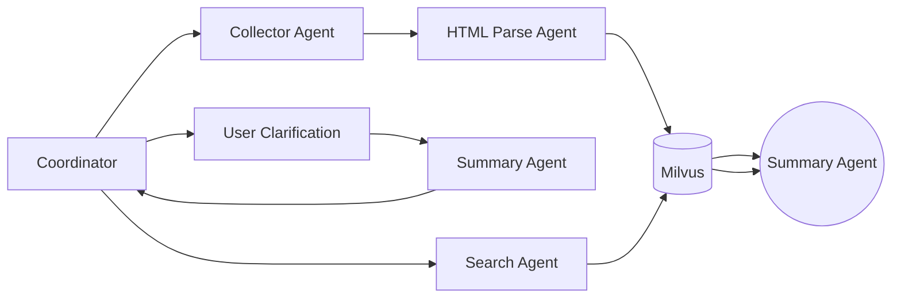

# 架构

论文下载&检索 Agent，效果为：用户输入一个会议名称，他负责帮我分析该会议的HTML结构，并且解析相应年份的 accepetd_papers，然后写爬虫去下载这会议该年份的所有论文，并且翻译摘要。
检索：用户输入一个关键字，使用 Embedding 在数据库中搜索。

# PRD

## Workflow
1. 用户输入一个会议名称以及年份，想要获取对应的所有 accepetd_papers。

## Tool 方面：
1. 首先需要一个网络搜索器，用于搜索会议相关信息。
2. 还需要一个 request 库，因为需要获取指定会议的 HTML 结构。
3. 同时这个 requests 库还得有下载 PDF 的功能。
4. 解析器操作，Agent 在操作解析器前，需要判断一个解析器是否存在。

所以当前可以定义出来如下的 TOOL:
1. `web_search`: 输入一个 TOPIC，调用 request 库，搜索 google。
2. `get_topic_url`：输入一个话题，获取这个话题的 URL，比如 USENIX 2025 Cycle 1 Accepted Paper 的 URL 为：https://www.usenix.org/conf%C3%A9rence/usenixsecurity25/cycle1-accepted-papers （对于有多轮审稿的会议，可能有多个返回值）
3. `get_html_content`: 输入一个 URL，获取 HTML 并返回。
4. `download_pdf`：输入 PDF 的 URL，下载并保存在预设路径内。
5. `get_parser`：输入对应网站的特征（比如 USENIX 会议的 index 页），获取它对应的解析器（主要是 BeautifulSoup），如果解析器不存在就调用 CodeAgent 写一个出来（包括测试）。

Agent 方面，要有：
1. 一个收集信息的 Agent，调用网络搜索等工具。
2. 一个写代码 Agent，负责写 python 代码，并且执行，并且需要 debug，因此需要如下几个tool:
   1. 文件编辑tool，包括替换哪些行，创建新文件等。
   2. 代码执行 tool，用于验证写好的代码。

信息检索方面，需要使用一个 RAG，做 Embedding。

# Evaluation
1. 评估写代码 Agent 与收集信息 Agent 如果合并的话会有什么效果。
2. 评估 RAG 不同 分词器，Embedding, Split, Search 的差异。（这是一个学习 RAG 相关知识的好机会）。
3. 评估多 Agent 中，不同 Agent 之间是怎么协作的。（三种协助机制：主从-Hierarchical、LECL-Sequential、评论家-写作家-主持人-Collaborative）
4. 在 3 的情况中，tool-use 有超时机制吗，怎么实现的？

# Progress

## 20251030
实现一个 Coding Agent 非常困难，实现它的难度已经要远远高于实现一个论文管理Agent了。
因此我们使用免费的Gemini-flash-lite-latest来做我们的HTML总结Agent，输入 HTML 给他，他输出一个 json 列表。